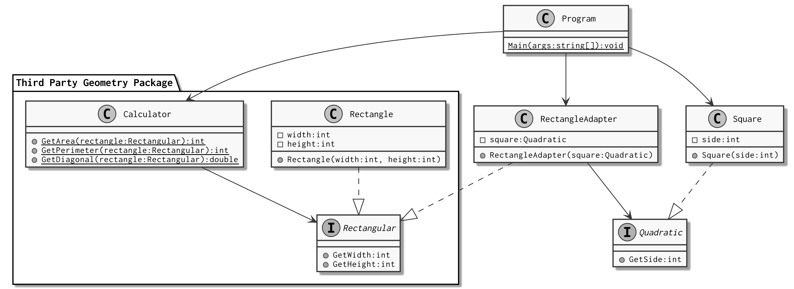

# Entwurfsmuster (Design Patterns)

Der Seitenbereich [Design Patterns](https://refactoring.guru/design-patterns)
von [refactoring.guru](https://refactoring.guru/) enthält hilfreiche
Informationen zum Lösen der folgenden Aufgaben.

Erstellen Sie einen Fork vom vorliegenden Repository und klonen Sie
anschliessend Ihr persönliches Repository.

Für jede Aufgabe gibt es ein separates Projekt, bei dem die Klasse `Program`
(Datei `Program.cs`) jeweils eine `Main()`-Methode enthält. Betrachten Sie
zunächst jeweils diese Methode, um den gegebenen Code verstehen zu können.

Bearbeiten Sie die folgenden Aufgaben:

## Aufgabe 0: Geometrie (`Geometry`)

Entwurfsmuster: [Adapter](https://refactoring.guru/design-patterns/adapter)
(_structural_)

Hierbei handelt es sich um das Beispiel aus den Folien:

Sie können die Anwendung folgendermassen ausführen:

    dotnet run --project Geometry

Studieren Sie den Code im `Geometry`-Verzeichnis und versuchen Sie diesen zu
verstehen.

Erweitern Sie den `Calculator` (`ThirdParty/Calculator.cs`) um eine weitere
Methode `double GetWidthHeightRatio(Rectangular)`, welche das Verhältnis von
Breite zur Höhe eines Rechtecks berechnet. Testen Sie diese Methode mit
Quadraten; das Verhältnis müsste jeweils `1.0` betragen.

## Aufgabe 1: Lohnbuchhaltung (`Payroll`)

Entwurfsmuster: [Adapter](https://refactoring.guru/design-patterns/adapter)
(_structural_)

Beim Projekt `Payroll` handelt es um eine kleine Mitarbeiterverwaltung mit
Lohnbuchhaltung.

Sie können die Anwendung folgendermassen ausführen:

    dotnet run --project Payroll

Das Modul `ThirdParty` ist eine Schnittstelle für die Lohnauszahlung. Mithilfe
der Klasse `Banking` und der Methode `PayOut` kann einem `AccountHolder` ein
Geldbetrag überwiesen werden.

Ihre Anwendung verwendet jedoch `Employee`-Objekte, welche das
`Employable`-Interface implementieren, aber dummerweise nicht das
`AccountHolder`-Interface.

Schreiben Sie einen Adapter, der das `AccountHolder`-Interface auf Basis von
einem `Employable` implementiert, sodass den bestehenden `Employee`-Objekten die
Löhne ausbezahlt werden können. (Tipp: Die Kontoverbindung erhalten Sie aus dem
`notes`-Dictionary der `Employee`-Klasse bzw. über die `GetNote()`-Methode von
`Employable`.)

## Aufgabe 2: Parkhaussimulation (`ParkingLot`)

Entwurfsmuster: [Observer](https://refactoring.guru/design-patterns/observer)
(_behavioral_)

Beim Projekt `ParkingLot` handelt es sich um eine kleine Parkhaussimulation.

Sie können die Anwendung folgendermassen ausführen:

    dotnet run --project ParkingLot

Ein Parkhaus (`ParkingLot`) hat einen Namen, eine Kapazität (`Capacity`) und
einen Füllstand (`Occupied`). Mithilfe der Methoden `Enter()` und `Exit()` kann
ein Auto in das Parkhaus einfahren bzw. dieses verlassen.

Die Klasse `Program` simuliert das Ein- und Ausfahren von Autos mit
nebenläufigen Threads. Die Methode `DisplayState()` zeigt dabei in einem eigenen
Thread den Füllstand in regelmässigen Intervallen an.

Bauen Sie die Simulation foldendermassen um:

1. Das Parkhaus soll als _Publisher_ agieren und seine _Subscriber_ jeweils
   informieren, wenn ein Auto in das Parkhaus einfährt oder es verlässt.
    - Erstellen Sie hierzu zwei Interfaces `Publisher` und `Subscriber` mit den
      entsprechenden Methoden.
2. Das `Display` soll als ein _Subscriber_ agieren, welcher über ein- und
   ausfahrende Autos des Parkhauses informiert wird.
    - Schreiben Sie hierzu eine neue Klasse für das `Display`.
3. Überlegen Sie sich, ob die Ereignisse als eine Reihe von Variablen (Name des
   Parkhauses, Füllstand usw.) übermittelt werden sollen, oder ob hier ein
   spezielles `Event`-Objekt hilfreich wäre.
4. Ein- und ausfahrende Autos einerseits und der Füllstand des Parkhauses
   andererseits sollen nicht mehr in getrennten Meldungen ausgegeben werden,
   sondern zusammen als eine Meldung:

Alt:

    A car entered the lot 'Bahnhof Parking'.
    Bahnhof Parking: 3/100 occupied
    Bahnhof Parking: 3/100 occupied
    Bahnhof Parking: 3/100 occupied
    A car left the lot 'Bahnhof Parking'.
    Bahnhof Parking: 2/100 occupied
    Bahnhof Parking: 2/100 occupied

Neu:

    A car entered the lot 'Bahnhof Parking': 3/100 occupied.
    A car left the lot 'Bahnhof Parking': 2/100 occupied.

Diese kompakte Ausgabe ist nur möglich, wenn auf Polling (d.h. Anfragen in
bestimmten Intervallen) verzichtet wird und man stattdessen einen Mechanismus
wie einen Observer verwendet.

## Aufgabe 3: Ligatabelle (`LeagueTable`)

Entwurfsmuster: [Builder](https://refactoring.guru/design-patterns/builder)
(_creational_)

Beim Projekt `LeagueTable` geht es um einen Aspekt aus dem bereits bekannten
`soccer-table`-Projekt.

Sie können die Anwendung folgendermassen ausführen:

    dotnet run --project LeagueTable

Die Klasse `TableRow` verfügt über einen Konstruktor mit sieben Parametern.
Die Erstellung der Objekte ist darum etwas mühsam; bestehende Deklarationen sind
schwer lesbar.

Erweitern Sie die Klasse `TableRow` um einen _Builder_, wodurch die
Objekterstellung einfacher und besser verständlich werden sollte.

Passen Sie das Hauptprogramm in `Program.cs` so an, dass dieser Gebrauch vom
Builder macht.
